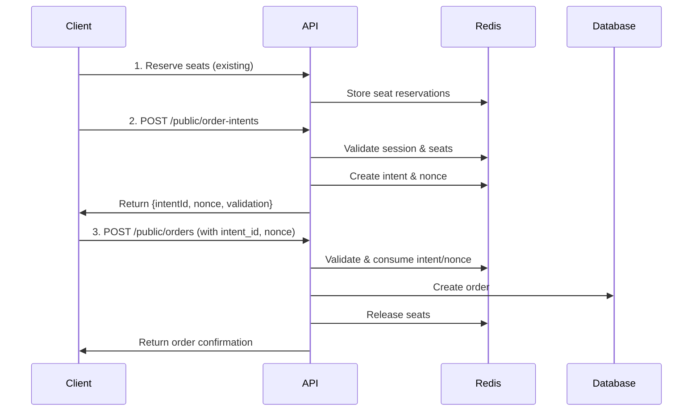
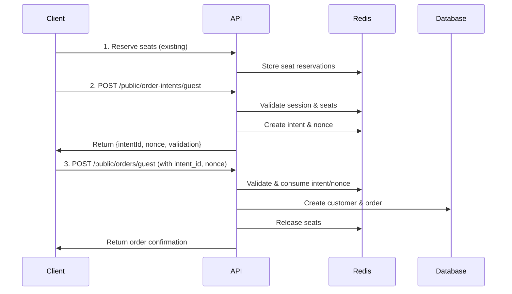

# 🔐 Enhanced Order Security System

## Overview

The Enhanced Order Security System provides robust protection against unauthorized order creation through a multi-layered approach combining session validation, order intents, and one-time nonces.

## ⚠️ Breaking Changes

**IMPORTANT**: This update introduces breaking changes to the order placement API. Frontend applications must be updated to use the new secure flow.

### What Changed

- Order placement now requires a two-step process: **Intent Creation** → **Order Placement**
- All order requests must include `intent_id`, `nonce`, and `session_id`
- Enhanced rate limiting on order endpoints
- Session-based validation enforced

## 🏗️ Security Architecture

### 1. Session-Based Flow (Existing + Enhanced)
- Users must have an active session with seat reservations
- Sessions are validated against the reservation system
- Only seats reserved by the session can be ordered

### 2. Order Intent System (New)
- Two-step process prevents unauthorized order manipulation
- Intent validates session, seats, and order details upfront
- Each intent is single-use and time-limited (30 minutes)

### 3. Nonce Protection (New)
- One-time tokens prevent replay attacks
- Generated with each intent, expires in 10 minutes
- Must be consumed during order placement

### 4. Enhanced Rate Limiting (New)
- **Order Intents**: 5 requests per 2 minutes per IP/session
- **Order Placement**: 10 requests per 5 minutes per IP/session
- Exponential backoff for failures

## 🔄 New Order Flow

### For Authenticated Customers



### For Guest Customers



## 🛠️ API Endpoints

### 1. Create Order Intent (Authenticated)

```http
POST /public/order-intents
Content-Type: application/json
X-Client-Id: your-client-id

{
  "sessionId": "session-uuid",
  "showId": "show-uuid",
  "seriesId": "series-uuid", 
  "totalAmount": 29.99,
  "currency": "EUR",
  "customerId": "customer-uuid"  // optional
}
```

**Response:**
```json
{
  "success": true,
  "message": "Order intent created successfully",
  "data": {
    "intentId": "intent-uuid",
    "nonce": "one-time-nonce",
    "expiresAt": 1640995200000,
    "validation": {
      "expectedSeatIds": ["A1", "A2"],
      "expectedTotal": 29.99,
      "expectedCurrency": "EUR"
    }
  }
}
```

### 2. Create Guest Order Intent

```http
POST /public/order-intents/guest
Content-Type: application/json
X-Client-Id: your-client-id

{
  "sessionId": "session-uuid",
  "showId": "show-uuid", 
  "seriesId": "series-uuid",
  "totalAmount": 29.99,
  "currency": "EUR",
  "email": "guest@example.com",
  "firstName": "John",
  "lastName": "Doe",
  "phone": "+49123456789"  // optional
}
```

### 3. Place Secure Order

```http
POST /public/orders
Content-Type: application/json
X-Client-Id: your-client-id

{
  "intent_id": "intent-uuid",
  "nonce": "one-time-nonce", 
  "session_id": "session-uuid",
  
  // Existing order fields...
  "customer_id": "customer-uuid",
  "show_id": "show-uuid",
  "series_id": "series-uuid",
  "total_amount": 29.99,
  "currency": "EUR",
  "financial_breakdown": { /* ... */ },
  "line_items": [ /* ... */ ],
  // ... other fields
}
```

### 4. Place Secure Guest Order

```http
POST /public/orders/guest
Content-Type: application/json
X-Client-Id: your-client-id

{
  "intent_id": "intent-uuid",
  "nonce": "one-time-nonce",
  "session_id": "session-uuid",
  
  // Guest details
  "email": "guest@example.com",
  "first_name": "John",
  "last_name": "Doe",
  "street": "Main St 123",
  "city": "Berlin",
  "postcode": "10115", 
  "country_code": "DE",
  
  // Existing order fields...
  "show_id": "show-uuid",
  "series_id": "series-uuid", 
  "total_amount": 29.99,
  "financial_breakdown": { /* ... */ },
  "line_items": [ /* ... */ ],
  // ... other fields
}
```

## 🔧 Frontend Integration

### JavaScript Example

```javascript
class SecureOrderClient {
  constructor(clientId, baseUrl) {
    this.clientId = clientId;
    this.baseUrl = baseUrl;
  }

  async createOrderIntent(orderData) {
    const response = await fetch(`${this.baseUrl}/public/order-intents`, {
      method: 'POST',
      headers: {
        'Content-Type': 'application/json',
        'X-Client-Id': this.clientId
      },
      body: JSON.stringify(orderData)
    });
    
    return response.json();
  }

  async placeOrder(orderData, intent) {
    const secureOrderData = {
      ...orderData,
      intent_id: intent.intentId,
      nonce: intent.nonce,
      session_id: orderData.sessionId
    };

    const response = await fetch(`${this.baseUrl}/public/orders`, {
      method: 'POST', 
      headers: {
        'Content-Type': 'application/json',
        'X-Client-Id': this.clientId
      },
      body: JSON.stringify(secureOrderData)
    });

    return response.json();
  }

  async placeSecureOrder(orderData) {
    try {
      // Step 1: Create intent
      const intent = await this.createOrderIntent(orderData);
      if (!intent.success) {
        throw new Error(intent.message);
      }

      // Step 2: Place order with intent
      const order = await this.placeOrder(orderData, intent.data);
      return order;
      
    } catch (error) {
      console.error('Secure order placement failed:', error);
      throw error;
    }
  }
}

// Usage
const client = new SecureOrderClient('your-client-id', 'https://api.example.com');

const orderData = {
  sessionId: 'session-uuid',
  showId: 'show-uuid',
  seriesId: 'series-uuid',
  totalAmount: 29.99,
  currency: 'EUR',
  customerId: 'customer-uuid',
  // ... other order data
};

try {
  const result = await client.placeSecureOrder(orderData);
  console.log('Order placed successfully:', result);
} catch (error) {
  console.error('Order failed:', error);
}
```

## ⚙️ Configuration

### Environment Variables

```env
# Redis Configuration (required for security features)
REDIS_HOST=localhost
REDIS_PORT=6379
REDIS_PASSWORD=your-redis-password

# Rate Limiting
RATE_LIMIT_WINDOW_MS=900000  # 15 minutes
RATE_LIMIT_MAX_REQUESTS=1000  # requests per window

# Security Timeouts (optional)
ORDER_NONCE_EXPIRATION_MS=600000    # 10 minutes
ORDER_INTENT_EXPIRATION_MS=1800000  # 30 minutes
```

### Service Configuration

```typescript
import { OrderIntentService } from '@/services/orderIntentService';

// Configure security timeouts
OrderIntentService.configure({
  nonceExpirationMs: 10 * 60 * 1000,      // 10 minutes
  intentExpirationMs: 30 * 60 * 1000,     // 30 minutes  
  requireSessionValidation: true,          // Enforce session validation
  validateSeatReservations: true,          // Validate seat reservations
  redisPrefix: 'order_security'            // Redis key prefix
});
```

## 🚨 Error Handling

### Common Error Codes

| Code | Description | Solution |
|------|-------------|----------|
| `SESSION_REQUIRED` | No active session provided | Create session and reserve seats first |
| `INVALID_INTENT` | Intent not found or expired | Create new order intent |
| `INVALID_NONCE` | Nonce invalid or expired | Request new nonce or create new intent |
| `SESSION_MISMATCH` | Session doesn't match intent | Use correct session from intent creation |
| `SEAT_MISMATCH` | Ordered seats don't match reserved seats | Update seat selection or create new intent |
| `AMOUNT_MISMATCH` | Order total doesn't match intent | Verify pricing and create new intent |
| `ALREADY_USED` | Intent or nonce already consumed | Create new order intent |

### Error Response Format

```json
{
  "success": false,
  "message": "Order security validation failed",
  "error": "Order total amount does not match intent",
  "code": "AMOUNT_MISMATCH"
}
```

## 📊 Monitoring & Debugging

### Security Statistics

```http
GET /public/order-intents/stats
Authorization: Bearer admin-token  // Production only
```

Response:
```json
{
  "success": true,
  "data": {
    "nonces": {
      "total": 150,
      "consumed": 120,
      "expired": 20,
      "active": 10
    },
    "intents": {
      "cleanedUp": 45
    },
    "timestamp": "2024-01-15T10:30:00.000Z"
  }
}
```

### Manual Cleanup

```http
POST /public/order-intents/cleanup
Authorization: Bearer admin-token
```

### Logs

The system provides detailed logging:

```
Order security event: intent_created
Order security event: order_placed  
Order security validation successful for intent abc-123
Generated nonce for client xyz, session 456, expires at 2024-01-15T11:00:00.000Z
Nonce consumed successfully for client xyz, session 456
```

## 🧪 Testing

### Unit Tests

```bash
# Test security services
npm test src/services/nonceService.test.ts
npm test src/services/orderIntentService.test.ts

# Test middleware
npm test src/middleware/orderSecurity.test.ts
```

### Integration Tests

```bash
# Test complete order flow
npm test src/controllers/orderSecurity.integration.test.ts
```

### Load Testing

```bash
# Test rate limiting effectiveness
artillery run test/load/order-security.yml
```

## 🔄 Migration Guide

### Updating Existing Frontend

1. **Update Order Flow**: Implement two-step process (intent → order)
2. **Add Security Fields**: Include `intent_id`, `nonce`, `session_id` in order requests
3. **Handle New Errors**: Implement error handling for security validation failures
4. **Update Rate Limiting**: Handle new rate limit responses
5. **Test Thoroughly**: Verify all order scenarios work with new security

### Backward Compatibility

⚠️ **No backward compatibility** - all order endpoints now require security validation.

### Deployment Checklist

- [ ] Redis is running and accessible
- [ ] Environment variables configured
- [ ] Frontend updated to use new flow
- [ ] Rate limiting rules reviewed
- [ ] Monitoring alerts configured
- [ ] Security logs reviewed

## 🛡️ Security Benefits

✅ **Prevents Unauthorized Orders**: Impossible to place orders without valid session + reservations  
✅ **Stops Replay Attacks**: One-time nonces prevent request reuse  
✅ **Prevents Order Manipulation**: Intent validation ensures data integrity  
✅ **Rate Limiting Protection**: Prevents abuse and DoS attacks  
✅ **Session Enforcement**: Orders must match reserved seats  
✅ **Time-Limited Tokens**: Automatic expiration prevents stale attacks  
✅ **Comprehensive Logging**: Full audit trail for security events  

## 🔧 Troubleshooting

### Common Issues

**Q: Frontend getting "Order security validation required" error**  
A: Ensure you're creating an order intent first and including all security fields in the order request.

**Q: "Session mismatch" errors**  
A: Verify the session ID used in intent creation matches the one in order placement.

**Q: "Nonce expired" errors**  
A: Nonces expire in 10 minutes. Create a new intent or request a new nonce.

**Q: Rate limiting errors**  
A: Wait for the rate limit window to reset or implement exponential backoff.

### Debug Mode

Set `NODE_ENV=development` for additional debug logs and relaxed rate limiting.

---

**Need Help?** Check the logs first, then review this documentation. For complex issues, examine the security validation middleware and services.
